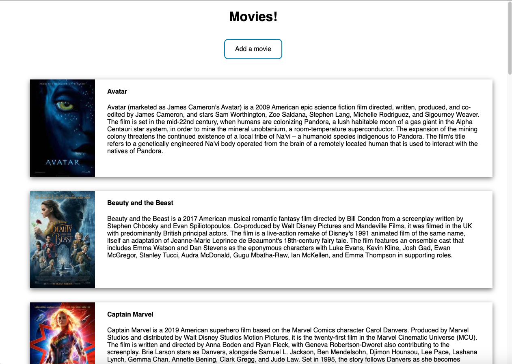
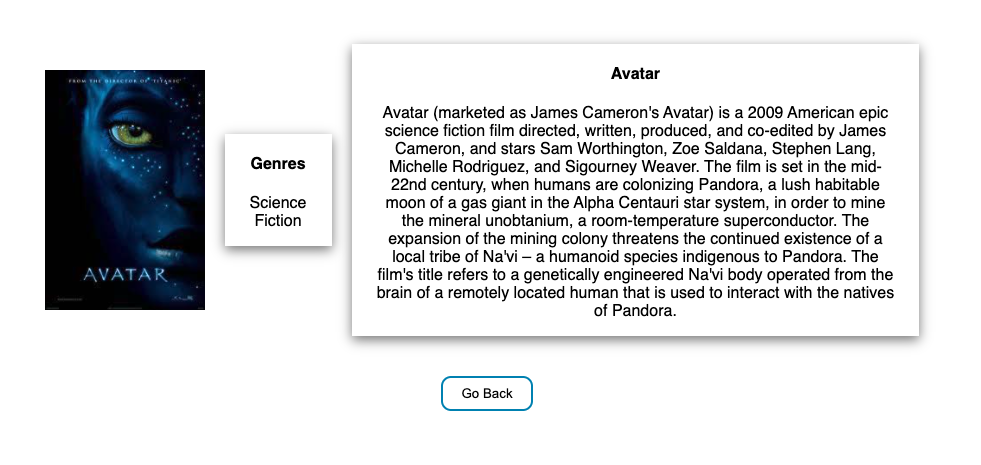
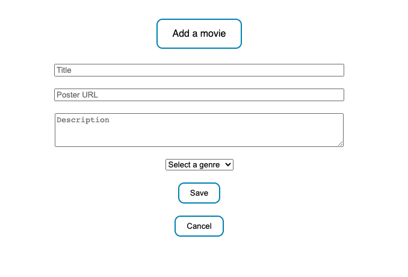

# Movie Database

## Description

_Duration: Weekend sprint_

This project displays movies, including a description and their poster, and allows users to add their own. If a poster is clicked, it leads the user to a specific page for that movie, showing more details, such as genre.

## Screen Shot

Home page/movie list

Specific movie details

Add a movie form

### Prerequisites

Link to software that is required to install the app (e.g. node).

- [Node.js](https://nodejs.org/en/)

## Installation

1. Create a database named `saga_movies_weekend`,
2. Using the database.sql file provided, initialize tables with the provided data. This project was built with [Postgres](https://www.postgresql.org/download/).
3. Open up your editor of choice and run an `npm install`
4. Run `npm run server` in your terminal
5. Run `npm run client` in your terminal

## Usage

Browse the initial list of movies and click whichever movie poster desired to see more details. Navigate to the "Add Movies" page by clicking the "Add a movie" link. From there, fill out the form to add a new movie to the existing list.

## Built With

- Express
- React
- Redux
- Postgres
- Javascript
- CSS

## Contact

For any questions on this project, contact me at [mahler.sam@gmail.com](mailto:mahler.sam@gmail.com)